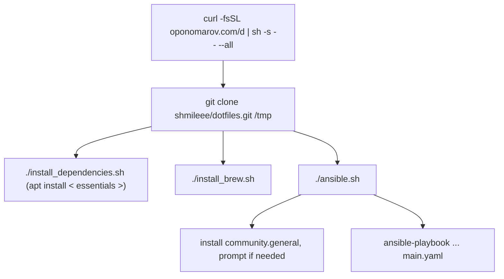

# Dotfiles

Fully automated development environment. Read the full documentation
[here](https://dotfiles.oponomarov.com).

[](https://github.com/shmileee/dotfiles/actions/workflows/macos.yaml)
[](https://github.com/shmileee/dotfiles/actions/workflows/docker.yaml)

## Installation

Install everything with single `curl` command:

```bash
curl -fsSL oponomarov.com/d | sh -s -- --all
```

## Running Inside Docker

Run `docker run -it shmileee/dotfiles` to spawn a docker container which is
automatically [built and
pushed](https://github.com/shmileee/dotfiles/actions/workflows/docker.yaml) with
GitHub Actions or build your own:

```bash
docker buildx build --platform linux/amd64 -t dotfiles --progress plain .
```

## Installation Flow



## Credits

Many thanks to the [dotfiles community](https://dotfiles.github.io).
