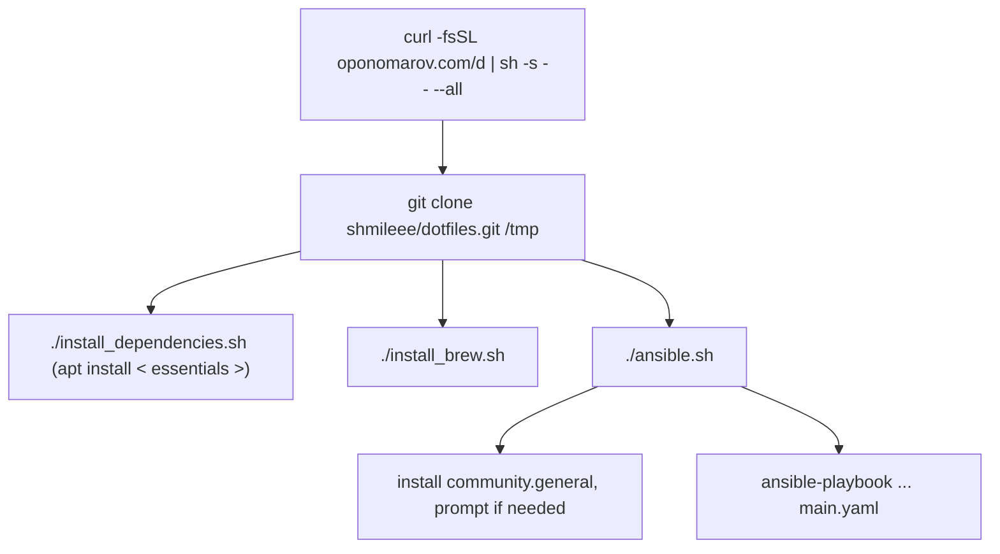

Install everything with single `curl` command:

```bash
curl -fsSL oponomarov.com/d | sh -s -- --all
```

??? Explanation

    The [`oponomarov.com/d`](https://oponomarov.com/d) is a short redirect URL
    that points to the
    [`shmileee/dotfiles@master:scripts/setup.sh`](https://github.com/shmileee/dotfiles/blob/master/scripts/setup.sh).
    The script handles the installation of Ansible prerequisites and executes the
    main Ansible playbook. Both the script and playbook are designed to work with
    macOS and Debian-based Linux distributions.

    For a fresh macOS installation, run the following commands first:

    ```bash
    sudo softwareupdate -i -a
    xcode-select --install
    ```

    To initiate the setup process, run the script. Alternatively, you can
    download and review the script before running it:

    ```bash
    curl -fsSL https://raw.githubusercontent.com/shmileee/dotfiles/master/scripts/setup.sh > setup.sh
    chmod +x setup.sh
    ./setup.sh --all
    ```

    This script performs the following tasks:

    - Downloads the repository `github.com/shmileee/dotfiles` into
      `/tmp/.dotfiles` using `git`, `curl`, or `wget`.
    - Installs the required system dependencies:
        - On Linux, it installs the
          [`essentials`](https://github.com/shmileee/dotfiles/blob/master/scripts/linux/essentials.apt).
        - On macOS, dependencies are installed via Homebrew.
    - Installs Ansible. For Linux, this happens during the system dependencies step; for macOS, it is managed through Homebrew.
    - Installs Homebrew if it is not already available (macOS only).
    - Executes the [`ansible.sh`](https://github.com/shmileee/dotfiles/blob/master/scripts/common/ansible.sh) script, which:
        - Installs the `community.general` Ansible collection.
        - Checks for passwordless `sudo` access or prompts for a password if needed.
        - Runs the [`main.yaml`](https://github.com/shmileee/dotfiles/blob/master/scripts/common/ansible/main.yaml) Ansible playbook.

#### Installation Flow



#### Running Inside Docker

Run `docker run -it shmileee/dotfiles` to start a Docker container that is
automatically [built and
pushed](https://github.com/shmileee/dotfiles/actions/workflows/docker.yaml)
using GitHub Actions. Alternatively, you can build it yourself:

```bash
docker buildx build --platform linux/amd64 -t dotfiles --progress plain .
```

## Credits

Many thanks to the [dotfiles community](https://dotfiles.github.io).
