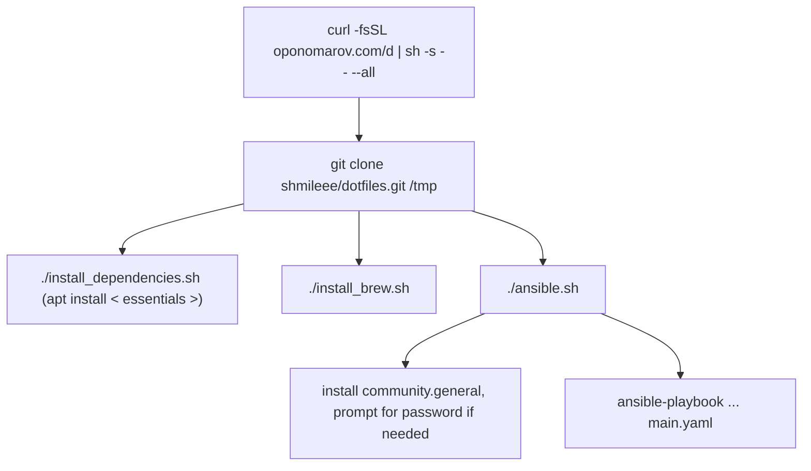

<section class="docs-hero" markdown>
  <p class="section-eyebrow">Personal workstation · documented in public</p>
  <h1>Hitchhiker's Guide to the Dotfiles<span class="hero-cursor" aria-hidden="true"></span></h1>
  <p class="hero-copy">A reproducible workstation built with Ansible, Homebrew, and a deliberately small bootstrap path. The setup supports macOS and Debian-based Linux without hiding what it changes.</p>
  <div class="hero-actions">
    <a class="primary-link" href="#install-everything">Install everything →</a>
    <a class="secondary-link" href="https://portfolio.oponomarov.com/">View the engineering portfolio ↗</a>
  </div>
</section>

## Install everything

Start a complete installation with a single `curl` command:

```bash
curl -fsSL oponomarov.com/d | sh -s -- --all
```

The supported workstation target is Apple Silicon macOS. Ubuntu 24.04 ARM64 is
continuously exercised as the container and integration target. Other
Debian-family systems remain best effort.

## Updating

`./scripts/setup.sh --all` installs declared state and reapplies configuration.
It is intentionally allowed to refresh Homebrew metadata and update managed
formulae and versioned casks. After a long gap, a run can therefore introduce
upstream changes. To review local dotfile changes before running it, clone the
repository and invoke the checked-out script; Ansible applies that checkout
rather than fetching `master` again.

There is no repository-wide upgrade command. Use the owner of each dependency:

- Run `brew upgrade` whenever a full Homebrew upgrade is desired.
- Let Renovate propose changes to versions declared in this repository.
- Use Lazy, Fisher, and TPM directly for intentional plugin updates, then review
  and commit the resulting lockfile, manifest, or Ansible commit-pin changes.

The checked-out chezmoi source is authoritative. Setup force-applies it, so add
intentional edits to the chezmoi-managed source before rerunning Ansible.

## Where configuration lives

- OS packages, applications, the default shell, and macOS preferences are owned
  by Ansible under `scripts/common/ansible/`.
- Home-directory files and templates are owned by chezmoi under `config/`.
- Developer runtimes and CLIs are declared in
  `config/private_dot_config/mise/config.toml`.
- Fish, tmux, and Neovim plugins are managed by Fisher, TPM, and Lazy
  respectively. Neovim’s working plugin graph is recorded in `lazy-lock.json`.
- Git credentials use the macOS keychain on macOS and Git’s in-memory credential
  cache on Linux; this repository does not configure plaintext credential
  storage.

## Validate locally

Run the same repository checks used by CI:

```bash
mise install
mise exec -- prek run --all-files
mise exec -- env ANSIBLE_CONFIG=scripts/common/ansible/ansible.cfg \
  ansible-playbook --inventory '127.0.0.1,' \
  --syntax-check scripts/common/ansible/main.yaml
mise exec -- ./scripts/common/ansible.sh --run --check
```

### Shell style

Bash formatting follows the
[Google Shell Style Guide](https://google.github.io/styleguide/shellguide.html):
two-space indentation without tabs, indented `case` alternatives, and binary
operators at the start of continued lines. `shfmt` applies that formatting and
ShellCheck checks correctness through pre-commit. Fish scripts use their native
`fish_indent` formatter.

??? Explanation

    The [`oponomarov.com/d`](https://oponomarov.com/d) is a short redirect URL
    that points to the
    [`shmileee/dotfiles@master:scripts/setup.sh`](https://github.com/shmileee/dotfiles/blob/master/scripts/setup.sh).
    The script handles the installation of Ansible prerequisites and executes the
    main Ansible playbook. Both the script and playbook are designed to work with
    Apple Silicon macOS and the Ubuntu 24.04 ARM64 integration environment.

    For a fresh macOS installation, run the following commands first:

    ```bash
    sudo softwareupdate -i -a
    xcode-select --install
    ```

    To initiate the setup process, run the script. Alternatively, you can
    download and review the script before running it:

    ```bash
    curl -fsSL https://raw.githubusercontent.com/shmileee/dotfiles/master/scripts/setup.sh > setup.sh
    chmod +x setup.sh
    ./setup.sh --all
    ```

    This script performs the following tasks:

    - Downloads the repository `github.com/shmileee/dotfiles` into
      `/tmp/.dotfiles` using `git`, `curl`, or `wget`.
    - Installs the required system dependencies:
        - On Linux, it installs the
          [`essentials`](https://github.com/shmileee/dotfiles/blob/master/scripts/linux/essentials.apt).
        - On macOS, dependencies are installed via Homebrew.
    - Installs Ansible. For Linux, this happens during the system dependencies step; for macOS, it is managed through Homebrew.
    - Installs Homebrew if it is not already available.
    - Executes the [`ansible.sh`](https://github.com/shmileee/dotfiles/blob/master/scripts/common/ansible.sh) script, which:
        - Installs the versioned `community.general` and `ansible.posix` Ansible collections.
        - Checks for passwordless `sudo` access or prompts for a password if needed.
        - Runs the [`main.yaml`](https://github.com/shmileee/dotfiles/blob/master/scripts/common/ansible/main.yaml) Ansible playbook.

#### Installation Flow


```mermaid
flowchart TD
    A["curl -fsSL oponomarov.com/d | sh -s -- --all"]
    A --> B["git clone shmileee/dotfiles.git /tmp"]

    B --> C["./install_dependencies.sh (apt install < essentials >)"]
    B --> D["./install_brew.sh"]

    B --> E["./ansible.sh"]
    E --> F["install community.general, prompt for password if needed"]
    E --> G["ansible-playbook ... main.yaml"]
```

#### Running Inside Docker

Run `docker run -it shmileee/dotfiles` to start a Docker container that is
automatically [built, smoke-tested, and
published](https://github.com/shmileee/dotfiles/actions/workflows/docker.yaml)
from `master` using GitHub Actions. Pull requests build and test without
publishing. Alternatively, you can build it yourself:

```bash
docker buildx build --platform linux/arm64 -t dotfiles --progress plain .
```

## Credits

Many thanks to the [dotfiles community](https://dotfiles.github.io).
